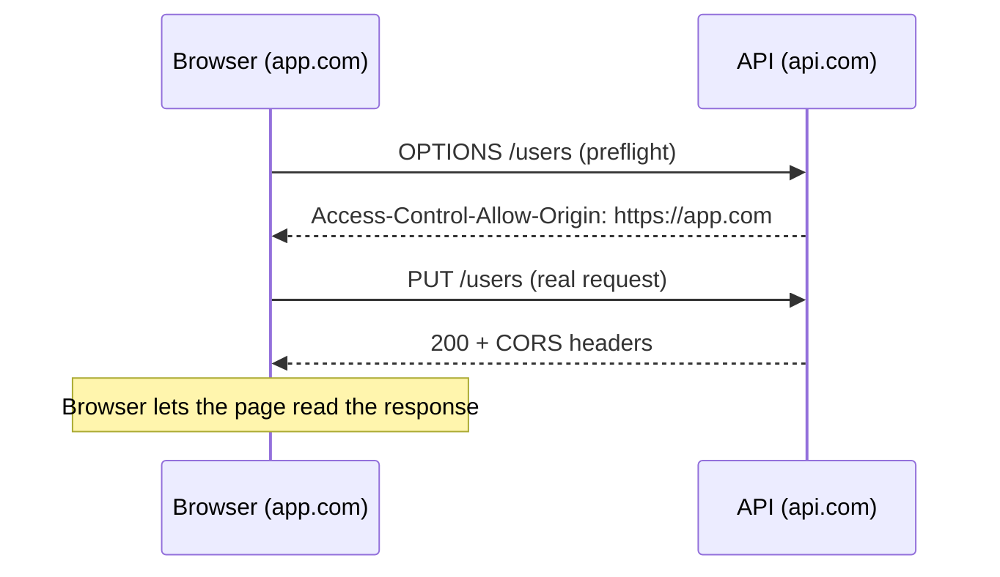

**Cross-Origin Resource Sharing** — a **browser** security rule. A page on `https://app.com` can't read responses from `https://api.com` unless the API says it's allowed via response headers.

- Origin = protocol + domain + port
- It is enforced by the browser only — Postman/curl ignore it
- For non-simple requests (e.g. `PUT`, JSON body, custom headers) the browser first sends a **preflight** `OPTIONS` request

```javascript
const cors = require('cors');
app.use(cors({ origin: 'https://app.com', credentials: true }));
```



---
