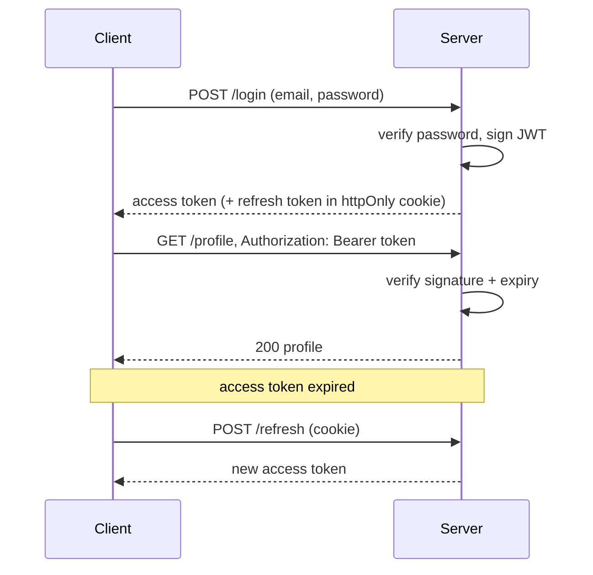

**JSON Web Token** — a signed token the server gives after login. The client sends it on every request, so the server doesn't need to store a session.

### Structure

```text
xxxxx.yyyyy.zzzzz
  │      │      └─ Signature: HMAC(header + payload, secret)
  │      └──────── Payload: { userId, role, exp }  (base64url — NOT encrypted)
  └─────────────── Header:  { alg: "HS256", typ: "JWT" }
```

- The payload is **readable by anyone** — never put passwords or secrets in it.
- The signature only proves it **wasn't tampered with**.

### Flow



```javascript
const jwt = require('jsonwebtoken');

// Login
const token = jwt.sign({ userId: user.id }, process.env.JWT_SECRET, { expiresIn: '15m' });

// Auth middleware
function auth(req, res, next) {
  const token = req.headers.authorization?.split(' ')[1];
  if (!token) return res.status(401).json({ error: 'No token' });
  try {
    req.user = jwt.verify(token, process.env.JWT_SECRET);
    next();
  } catch {
    res.status(401).json({ error: 'Invalid token' });
  }
}
```

### Best practices

- Short-lived **access token** (5–15 min) + longer **refresh token**
- Store the refresh token in an **httpOnly, Secure cookie** (JS can't read it → safer against XSS)
- JWTs can't easily be revoked before expiry — keep them short or keep a denylist

### JWT vs Session

| Session (cookie)                 | JWT                                  |
| -------------------------------- | ------------------------------------ |
| Server stores session (Redis/DB) | Stateless — server stores nothing    |
| Easy to revoke (delete session)  | Hard to revoke before expiry         |
| Needs shared store when scaling  | Scales easily across servers         |

### Authentication vs Authorization

- **Authentication** — *who are you?* (login, verify token) → failure = **401**
- **Authorization** — *what are you allowed to do?* (roles, ownership) → failure = **403**

---
