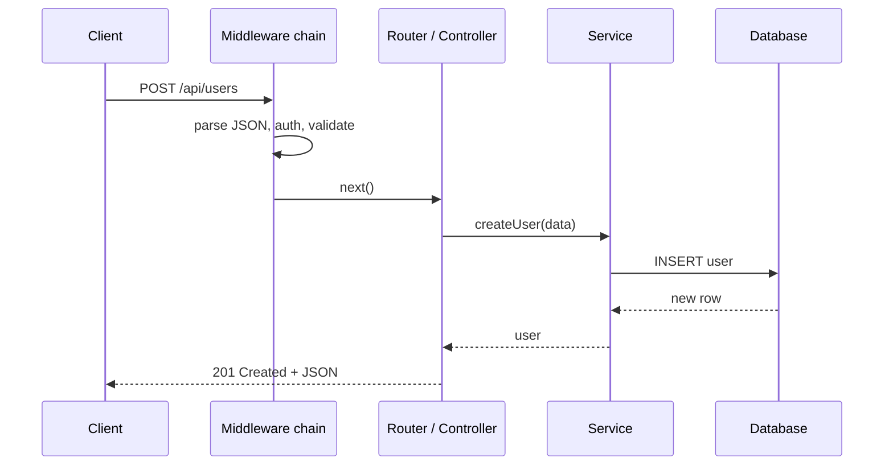

```mermaid
sequenceDiagram
    participant C as Client
    participant MW as Middleware chain
    participant R as Router / Controller
    participant S as Service
    participant DB as Database
    C->>MW: POST /api/users
    MW->>MW: parse JSON, auth, validate
    MW->>R: next()
    R->>S: createUser(data)
    S->>DB: INSERT user
    DB-->>S: new row
    S-->>R: user
    R-->>C: 201 Created + JSON
```

---
