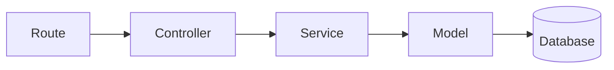

- **Model**: Data (database schemas)
- **View**: UI (templates) — in a JSON API, the JSON response
- **Controller**: Handles the request/response (thin)
- **Service**: Business logic (common addition to MVC)

```text
src/
├── routes/        user.routes.js      → URL → controller
├── controllers/   user.controller.js  → read req, call service, send res
├── services/      user.service.js     → business logic
├── models/        user.model.js       → DB schema
├── middlewares/   auth.js, error.js
└── app.js
```



---
