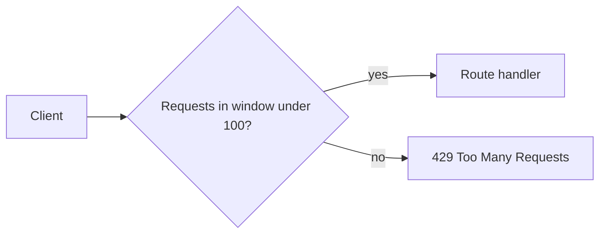

Prevents too many requests from one client (brute-force, abuse).

```javascript
const rateLimit = require('express-rate-limit');

const limiter = rateLimit({
  windowMs: 15 * 60 * 1000, // 15 minutes
  max: 100, // limit each IP to 100 requests per windowMs
  message: 'Too many requests',
});

app.use('/api', limiter);
```

With multiple servers, store the counters in **Redis** so all servers share the same limit.



---
