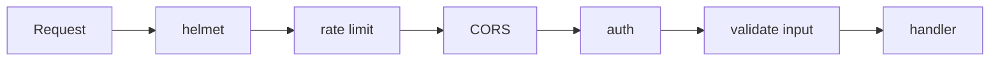

- Helmet (secure HTTP headers)
- Authentication (JWT / sessions) and authorization checks on every protected route
- Rate limiting (especially on login)
- Input validation (Joi, Zod)
- HTTPS/TLS
- Strict CORS configuration
- Sanitize inputs and escape output (prevent XSS, NoSQL/SQL injection)
- Hash passwords with bcrypt/argon2 — never store plain text
- Keep secrets in env vars; keep dependencies updated (`npm audit`)

---
