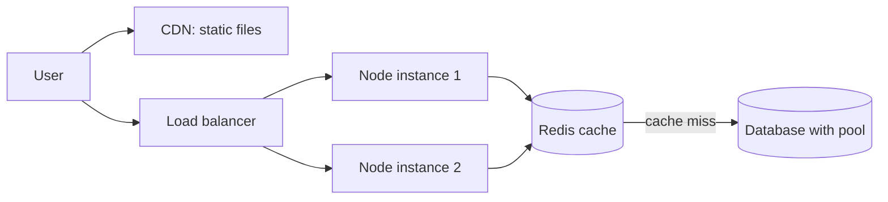

- Caching (Redis)
- Clustering / multiple instances (use all CPU cores)
- Load balancing
- Use streams for large files
- Database connection pooling and indexes
- Compression (gzip / brotli)
- Avoid sync (`*Sync`) calls inside request handlers
- Move CPU-heavy work to worker threads or a job queue
- Use a CDN for static files

---
