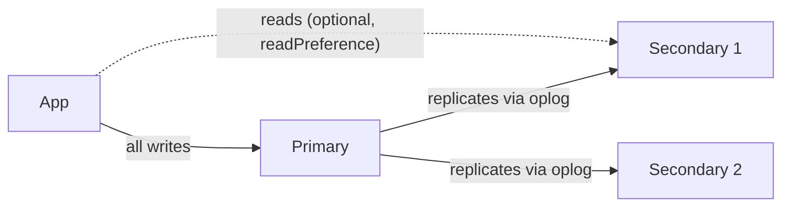

Duplicate data across multiple servers for **high availability**.



```text
Failover (automatic election)

 Primary ✖ crashes
     │
     ▼
 Secondaries notice missing heartbeats (~10s)
     │
     ▼
 Election → majority votes → Secondary 1 becomes NEW Primary
     │
     ▼
 Driver reconnects automatically, writes continue
```

- Use an **odd number** of voting members (usually 3) so a majority can always be formed.
- Reads from secondaries can be slightly **stale** (replication lag).
