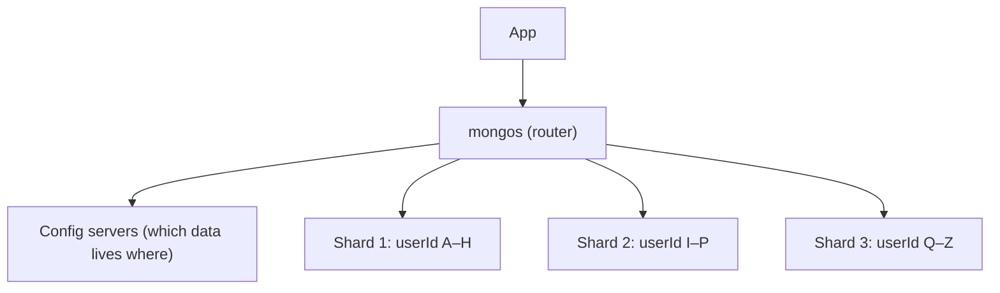

Horizontal data split across multiple servers — each shard holds a subset of the data.



### Choosing a Shard Key

The **shard key** decides which shard a document goes to. A bad key cannot be fixed easily later.

| Good shard key                             | Bad shard key                                   |
| ------------------------------------------ | ----------------------------------------------- |
| High cardinality (many distinct values)    | Low cardinality (e.g. `country`, `status`)      |
| Spreads writes evenly                      | Always increasing (e.g. `createdAt`, ObjectId) with range sharding |
| Used in most queries (targeted queries)    | Not in queries → every query hits every shard   |

```text
Range sharding on createdAt (always increasing)

Shard 1  [old data]        idle
Shard 2  [old data]        idle
Shard 3  [newest data] ◄── ALL new writes  = "hot shard"

Fix: hashed shard key → hash(createdAt) spreads writes across all shards
```
