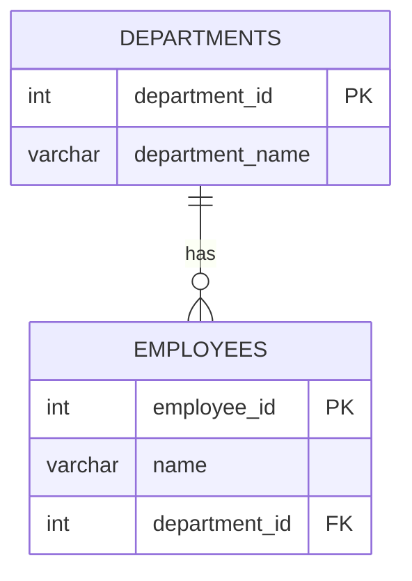

A **primary key** uniquely identifies a row in a table.

```sql
CREATE TABLE employees (
   employee_id SERIAL PRIMARY KEY,
   name VARCHAR(100)
);
```

A **foreign key** creates a relationship between two tables by referring to the primary key of another table.

```sql
CREATE TABLE departments (
   department_id SERIAL PRIMARY KEY,
   department_name VARCHAR(100)
);

CREATE TABLE employees (
   employee_id SERIAL PRIMARY KEY,
   name VARCHAR(100),
   department_id INT,
   FOREIGN KEY (department_id) REFERENCES departments(department_id)
);
```



| Primary Key                              | Foreign Key                              |
| ---------------------------------------- | ---------------------------------------- |
| Uniquely identifies a row                | Connects one table to another            |
| Must be unique                           | Can have duplicate values                |
| Cannot be `NULL`                         | Can be `NULL` depending on the relationship |
| One per table (can be composite)         | A table can have multiple foreign keys   |
| Example: `users.id`                      | Example: `orders.user_id`                |

**ON DELETE options:** `CASCADE` (delete children too), `SET NULL`, `RESTRICT` / `NO ACTION` (block the delete, the default).
