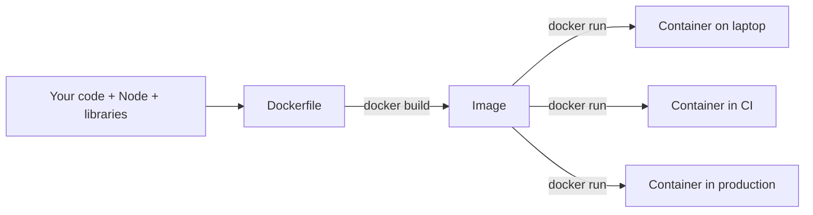

---

[**Docker**](https://www.docker.com/) is a container platform that developers use to package applications with all their dependencies so they can run smoothly across different environments.

Although containers share the same OS kernel, each one operates in its own isolated environment. This setup minimizes compatibility issues, reduces delays, and improves communication between development, testing, and operations teams.

**The problem it solves:** "It works on my machine." The container carries the app, the runtime, and the libraries, so it runs the same on a laptop, CI, and production.

---
