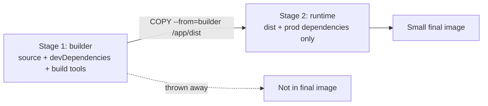

Use one stage to **build** (with compilers, dev dependencies) and a second, small stage to **run** only the output. The final image is much smaller and has less attack surface.

```dockerfile
# Stage 1: build
FROM node:20-alpine AS builder
WORKDIR /app
COPY package*.json ./
RUN npm ci
COPY . .
RUN npm run build

# Stage 2: run
FROM node:20-alpine
WORKDIR /app
COPY package*.json ./
RUN npm ci --omit=dev
COPY --from=builder /app/dist ./dist
CMD ["node", "dist/server.js"]
```



---
