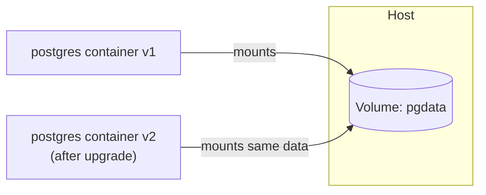

A container's filesystem is **lost when the container is removed**. Volumes store data **outside** the container so it survives restarts and removal.

| Type          | Example                                   | Use for                          |
| ------------- | ----------------------------------------- | -------------------------------- |
| Named volume  | `-v pgdata:/var/lib/postgresql/data`      | Databases, persistent data (managed by Docker) |
| Bind mount    | `-v $(pwd):/app`                          | Local development (live code reload) |
| tmpfs         | `--tmpfs /tmp`                            | Temporary in-memory data         |

---
