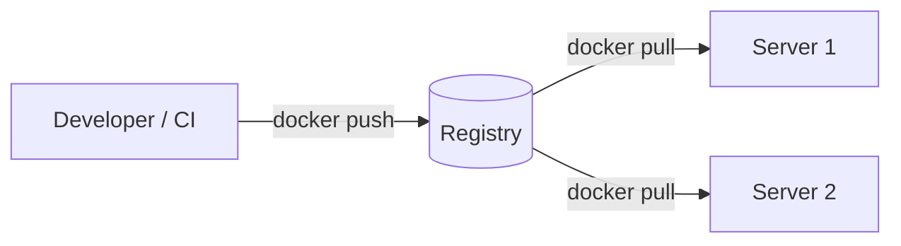

A place to store and share images: **Docker Hub**, **AWS ECR**, **GitHub Container Registry**.

---

# Quick Fire Questions

- **Image vs container?** Template vs running instance
- **Does a container have its own kernel?** No, it shares the host kernel
- **RUN vs CMD?** Build time vs run time
- **Where should persistent data go?** A volume
- **How do containers talk to each other?** Same network, by service name
- **Why copy `package.json` first?** Layer caching for dependencies
- **How to make images smaller?** Alpine/slim base, multi-stage build, `.dockerignore`
- **`EXPOSE` publishes the port?** No, only `-p` publishes it
