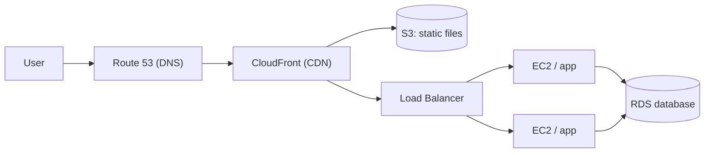

---

AWS stands for **Amazon Web Services**. It is a cloud computing platform that provides services like servers, storage, databases, networking, security, monitoring, and machine learning.

| Service | What it does                                                                                       |
| ------- | -------------------------------------------------------------------------------------------------- |
| **EC2** | Provides virtual servers to run your applications                                                  |
| **VPC** | Provides a private virtual network to control traffic, security, and isolation for those servers |

A typical web app on AWS:

---
