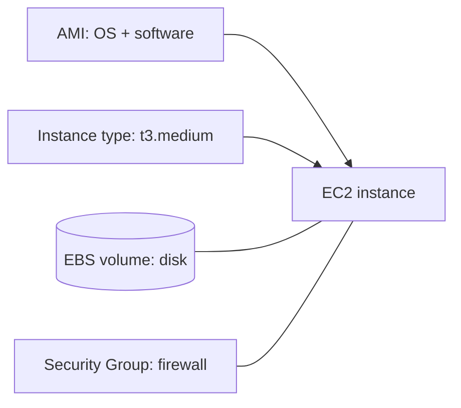

1. A service that provides virtual servers in the cloud.
2. These servers are called **instances**.
3. You choose the instance type (CPU/RAM), the OS (via an AMI), storage (EBS), and network (VPC, subnet, security group).

---
