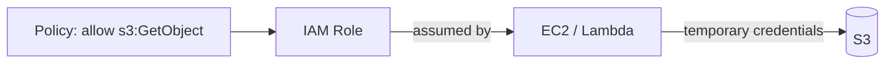

1. Used to manage users, roles, permissions, and access to AWS resources.

| Term       | Meaning                                                                 |
| ---------- | ----------------------------------------------------------------------- |
| **User**   | A person or app with long-term credentials                              |
| **Group**  | A collection of users sharing the same permissions                      |
| **Role**   | A set of permissions that a service or user **assumes** temporarily (no long-term keys) |
| **Policy** | A JSON document that says what is allowed or denied                     |

```json
{
  "Version": "2012-10-17",
  "Statement": [
    {
      "Effect": "Allow",
      "Action": ["s3:GetObject", "s3:PutObject"],
      "Resource": "arn:aws:s3:::my-app-uploads/*"
    }
  ]
}
```



**Best practices:**

- **Least privilege** — grant only what is needed.
- Give EC2/Lambda a **role**, never hardcode access keys in code.
- Enable **MFA**, and don't use the root account for daily work.
- An explicit **Deny** always wins over an Allow.

---
