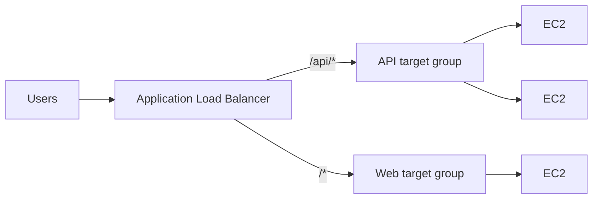

A **Load Balancer** distributes incoming traffic across multiple servers. It improves application availability, performance, and fault tolerance. It also runs **health checks** and stops sending traffic to unhealthy instances.

AWS provides mainly these load balancers:

1. **Application Load Balancer** — used for HTTP and HTTPS traffic (Layer 7, can route by path or host).
2. **Network Load Balancer** — used for high-performance TCP/UDP traffic (Layer 4).
3. **Gateway Load Balancer** — used for security appliances like firewalls.

---
