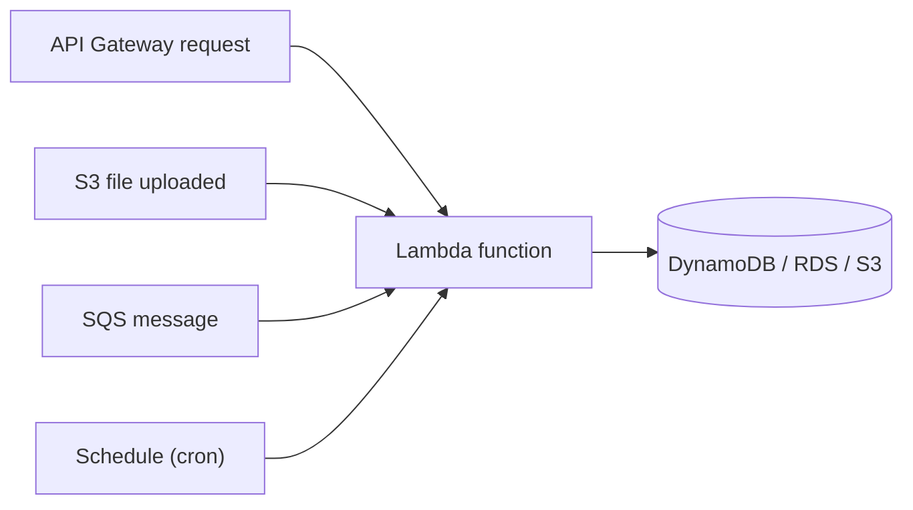

1. **AWS Lambda** is a serverless compute service.
2. You upload code, and AWS runs it automatically when triggered. You do not need to manage servers.
3. You pay per request and per execution time. Max run time is **15 minutes** per invocation.

---
