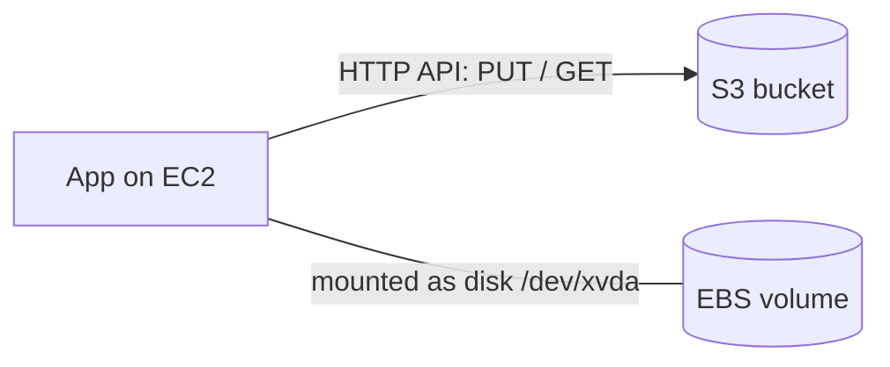

| **S3**                                      | **EBS**                   |
| ------------------------------------------- | ------------------------- |
| Object storage                              | Block storage             |
| Used for files, backups, and static content | Used like a disk drive    |
| Independent storage, accessed over HTTP     | Attached to EC2 instances |
| Regional, practically unlimited             | One AZ, fixed size you choose |

---
