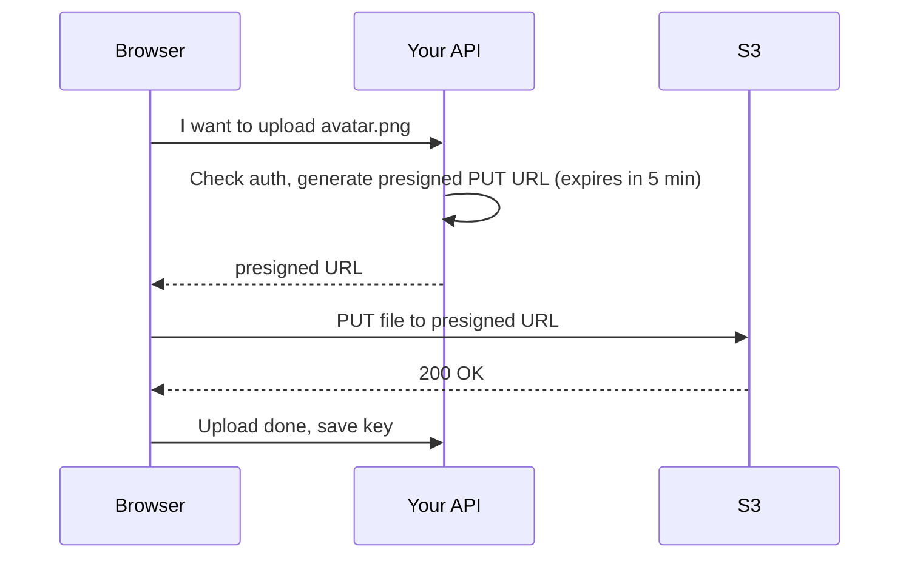

A **temporary URL** that lets someone upload or download a private S3 object **without AWS credentials**. It expires after a set time.

Common use: let the browser upload a file **directly to S3**, so the file never passes through your server.



```javascript
import { S3Client, PutObjectCommand } from '@aws-sdk/client-s3';
import { getSignedUrl } from '@aws-sdk/s3-request-presigner';

const s3 = new S3Client({ region: 'ap-south-1' });
const command = new PutObjectCommand({ Bucket: 'my-app-uploads', Key: 'users/42/avatar.png' });
const url = await getSignedUrl(s3, command, { expiresIn: 300 });
```

---
