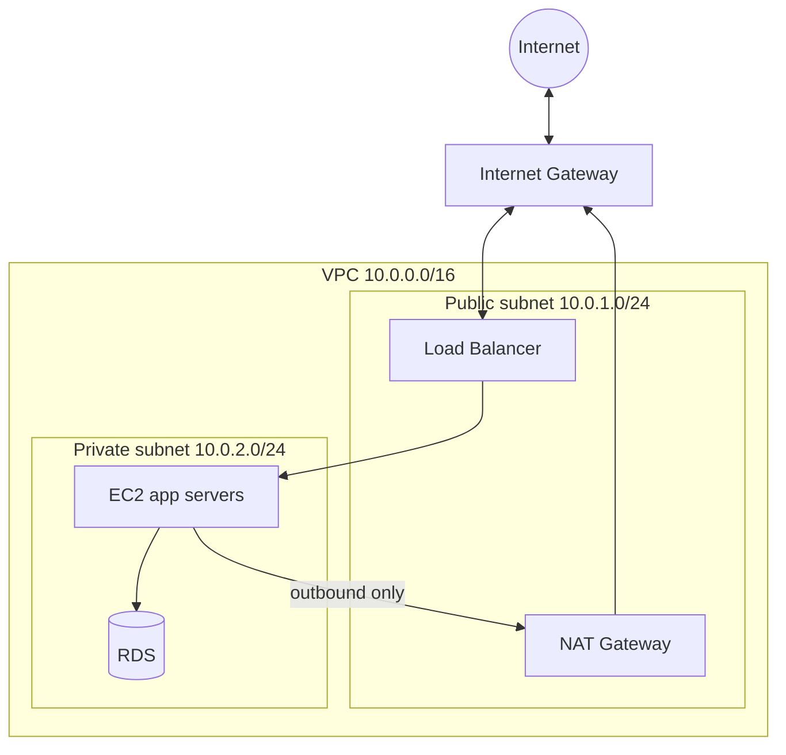

1. A **public subnet** has a route to the internet through an **Internet Gateway**.
2. A **private subnet** does not have direct internet access. It is usually used for databases or backend servers. It can reach the internet for updates through a **NAT Gateway** (outbound only).

---
