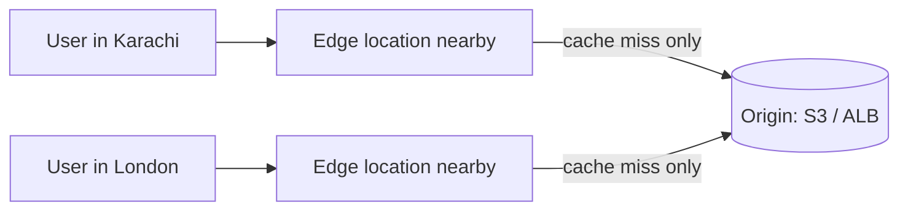

1. **CloudFront** is a Content Delivery Network, or CDN.
2. It delivers content like images, videos, APIs, and websites faster by caching them at edge locations close to users.

On a **cache hit**, the edge responds directly. On a **miss**, it fetches from the origin once and caches the result.

---
