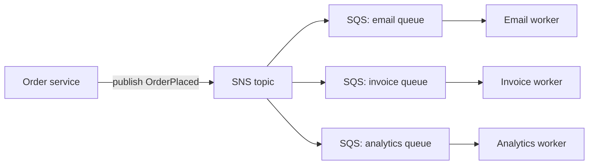

| **SQS** (Simple Queue Service)                  | **SNS** (Simple Notification Service)            |
| ----------------------------------------------- | ------------------------------------------------ |
| Queue — **pull** model                          | Pub/sub — **push** model                         |
| One message is processed by **one** consumer    | One message is delivered to **many** subscribers |
| Messages wait until a worker reads them         | Messages are pushed immediately                  |
| Good for background jobs, buffering spikes      | Good for fan-out, alerts, notifications          |

Common pattern — **fan-out**: SNS sends one event to several SQS queues, each processed independently.

---
