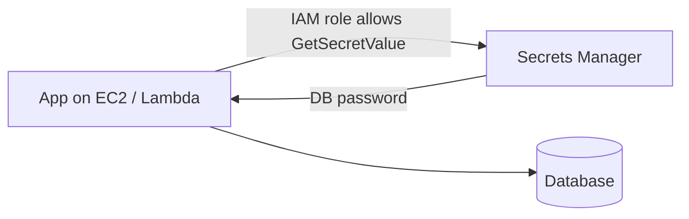

1. Secrets should be stored in **AWS Secrets Manager** or **Systems Manager Parameter Store**.
2. They should not be hardcoded in code or stored in plain text.
3. **AWS Secrets Manager** stores and manages sensitive information like database passwords, API keys, and credentials. It can also rotate secrets automatically.

---
