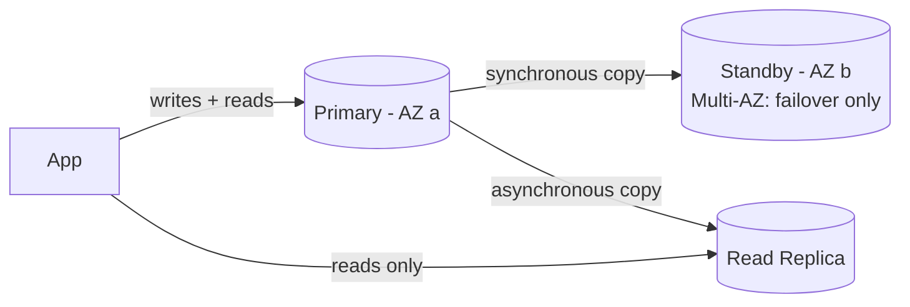

1. A **Read Replica** is a copy of a database used to handle read traffic.
2. It improves performance by reducing load on the primary database.
3. Replication is **asynchronous**, so replicas can be slightly behind the primary.

| Multi-AZ                      | Read Replica                     |
| ----------------------------- | -------------------------------- |
| For **availability**          | For **read performance**         |
| Synchronous replication       | Asynchronous replication         |
| Automatic failover            | Manual promotion if needed       |

---
