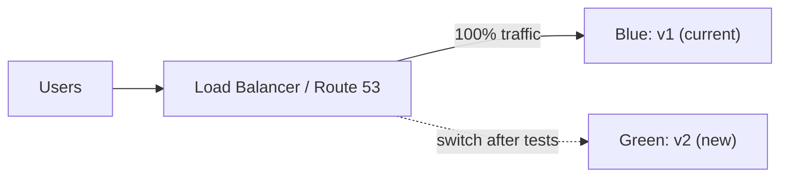

Blue-green deployment uses two environments:

- **Blue** is the current production environment.
- **Green** is the new version.

Traffic is shifted from blue to green after testing. This reduces downtime and rollback risk. To roll back, switch traffic back to blue.

---
