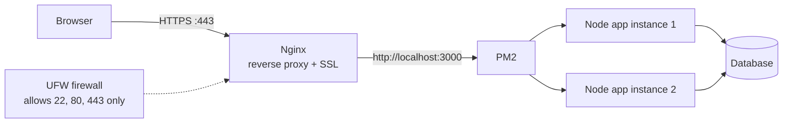

Typical production setup on a single VPS:

Steps:

1. Create the VPS and log in with an **SSH key**.
2. Create a non-root user, update packages, enable the **firewall**.
3. Install Node.js, Git, Nginx, PM2.
4. Clone the repo, install dependencies, build, set environment variables.
5. Start the app with **PM2**.
6. Configure **Nginx** as a reverse proxy to the app's port.
7. Point the domain's DNS **A record** to the VPS IP.
8. Add **SSL** with Let's Encrypt (Certbot).

---
