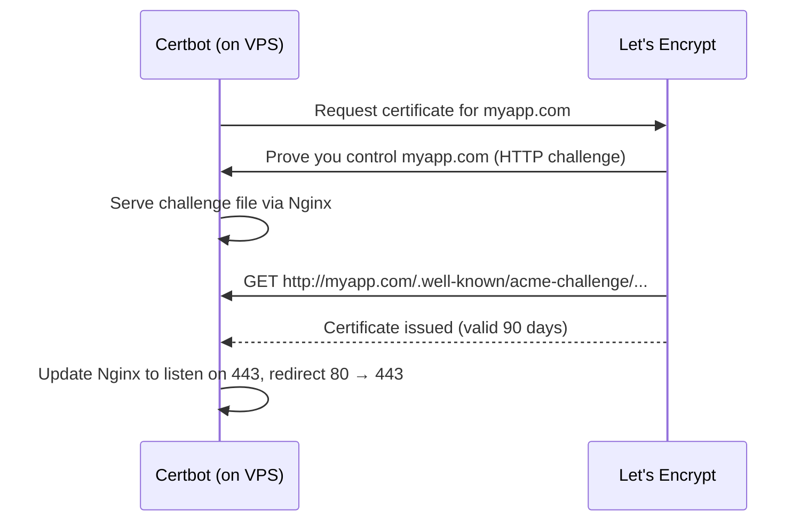

**Let's Encrypt** is a free certificate authority. **Certbot** gets the certificate, edits the Nginx config, and sets up automatic renewal (certificates last **90 days**).

```bash
sudo apt install certbot python3-certbot-nginx
sudo certbot --nginx -d myapp.com -d www.myapp.com
sudo certbot renew --dry-run   # test auto-renewal
```



The domain's DNS must already point to the VPS, and port 80 must be open, for the HTTP challenge to work.

---
