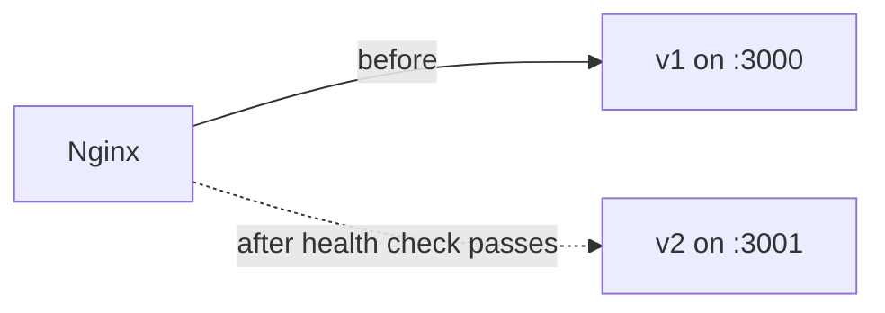

The goal: users never see an error while the new version starts.

**Option 1 — PM2 reload (simple):** `pm2 reload` restarts cluster workers **one at a time**, so some workers always serve traffic.

**Option 2 — release folders + symlink:** build the new version in a new folder, then switch a symlink and reload.

```text
/var/www/app/
├── releases/
│   ├── 2026-09-30/
│   └── 2026-10-01/   ← new build, dependencies installed, tested
└── current -> releases/2026-10-01   ← switch symlink, then pm2 reload
```

**Option 3 — blue-green on two ports:** run the new version on port 3001, health-check it, switch Nginx `proxy_pass`, then `nginx -s reload` (Nginx reloads gracefully without dropping connections).



Typical deploy script (CI or manual):

```bash
git pull
npm ci
npm run build
pm2 reload api   # workers restart one by one
```

Run database migrations in a **backward-compatible** way, so the old and new versions can both run during the switch.
