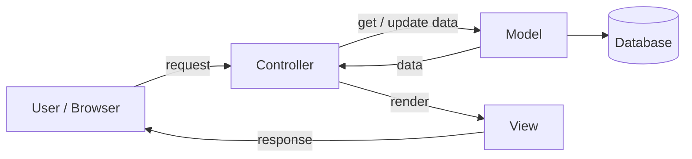

**MVC (Model–View–Controller)** splits an app into three parts:

- **Model** — data and business rules (e.g. `User`, database access).
- **View** — what the user sees (HTML template, or JSON in an API).
- **Controller** — receives the request, calls the model, returns the view.



Express example:

```javascript
// routes: GET /users/:id → controller
router.get('/users/:id', userController.getUser);

// controller
async function getUser(req, res) {
  const user = await User.findById(req.params.id); // model
  res.json(user); // view (JSON)
}
```

---
