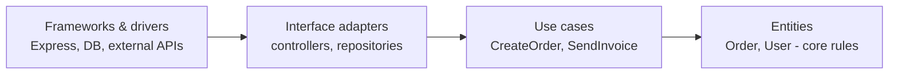

The core idea: **dependencies point inward**. Business rules (entities, use cases) are in the center and know nothing about frameworks, databases, or HTTP. Outer layers depend on inner layers — never the opposite.

The use case defines an **interface** (e.g. `OrderRepository`), and the outer layer provides the implementation (e.g. `PostgresOrderRepository`). This is **dependency inversion**. You could swap Postgres for MongoDB without touching business logic.

---
