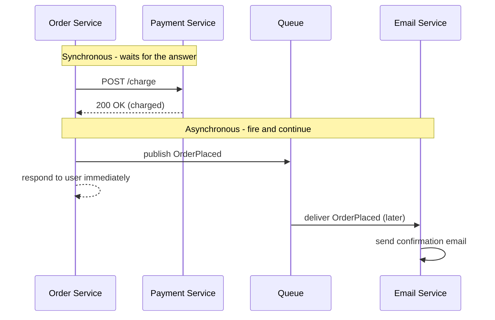

- **Synchronous**: the caller sends a request and **waits** for the response (HTTP/REST, gRPC).
- **Asynchronous**: the caller sends a message to a **queue/broker** and continues; another service processes it later (RabbitMQ, Kafka, SQS).

| Synchronous                                  | Asynchronous                                      |
| -------------------------------------------- | ------------------------------------------------- |
| Simple, immediate result                     | Caller doesn't wait — faster response             |
| If the other service is down, the call fails | Messages wait in the queue until the service is back |
| Services are tightly coupled                 | Services are loosely coupled                      |
| Use when you **need the answer now** (payment check) | Use for work that can happen later (emails, reports) |

---
