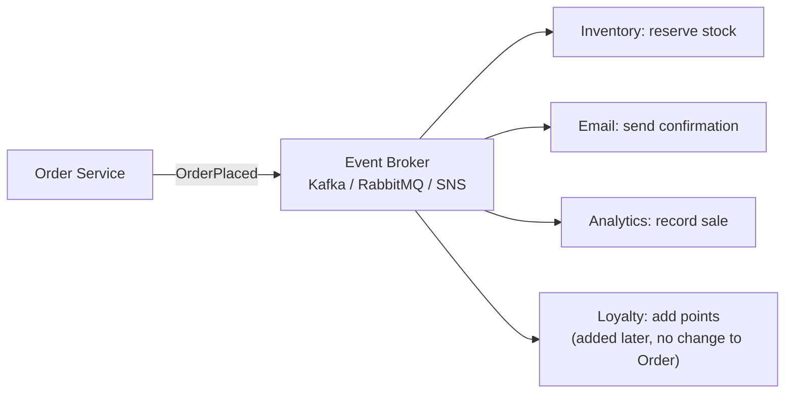

Services communicate by **publishing events** ("something happened") instead of calling each other directly. Other services **subscribe** to the events they care about.

The publisher doesn't know who listens. Adding a new feature means adding a new subscriber — the publisher doesn't change.



**Pros:** loose coupling, easy to extend, absorbs traffic spikes.
**Cons:** harder to debug and trace, **eventual consistency**, must handle duplicate events (make consumers **idempotent**).

---

# What is an API Gateway?

An **API Gateway** is a single entry point that acts as the **front door** for your entire backend system.

Instead of clients communicating directly with every individual microservice, they communicate with the **API Gateway**, which then routes requests to the appropriate service.

### Example

```text
                    ┌─────────────────┐
                    │     Client      │
                    │ Web / Mobile    │
                    └────────┬────────┘
                             │
                             ▼
                    ┌─────────────────┐
                    │   API Gateway   │
                    └────────┬────────┘
                             │
             ┌───────────────┼───────────────┐
             │               │               │
             ▼               ▼               ▼
      ┌────────────┐  ┌────────────┐  ┌────────────┐
      │Auth Service│  │Payment     │  │Inventory   │
      │            │  │Service     │  │Service     │
      └────────────┘  └────────────┘  └────────────┘
```
