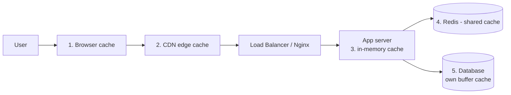

| API Gateway                                         | Load Balancer                                   |
| --------------------------------------------------- | ----------------------------------------------- |
| Routes to **different services** by path/rules      | Spreads traffic across **copies of the same** service |
| Auth, rate limiting, request transformation         | Health checks, traffic distribution             |
| Application-level (Layer 7)                         | Layer 4 or Layer 7                              |

They are often used together: Gateway → Load Balancer → service instances.

---

# Caching Layers

Caching stores a copy of data closer to the user so it doesn't have to be fetched or computed again.



| Layer             | Example                              | Caches                                |
| ----------------- | ------------------------------------ | ------------------------------------- |
| Browser           | `Cache-Control` headers              | Static files, API GET responses       |
| CDN               | CloudFront, Cloudflare               | Images, JS/CSS, public pages          |
| App in-memory     | `Map`, LRU cache                     | Small hot data (per server, not shared) |
| Distributed cache | Redis, Memcached                     | Sessions, query results, shared across servers |
| Database          | Postgres buffer cache                | Recently read pages                   |

### Cache-Aside (most common pattern)

```text
read(key):
  value = redis.get(key)
  if value:            → cache HIT  → return it
  else:                → cache MISS
     value = db.query(...)
     redis.set(key, value, TTL)
     return value

write(key):
  db.update(...)
  redis.del(key)       → invalidate so the next read refreshes
```

**Problems to mention:**

- **Stale data** — use a TTL and invalidate on writes.
- **Cache stampede** — many requests miss at the same time and all hit the DB; use a lock or stagger TTLs.
- "There are only two hard things in computer science: cache invalidation and naming things."

---

# Quick Fire Questions

- **Monolith or microservices for a new startup?** Modular monolith first
- **What does each microservice usually own?** Its own database
- **MVC stands for?** Model, View, Controller
- **Where does business logic live in layered architecture?** Service layer
- **Clean architecture rule?** Dependencies point inward
- **REST over-fetching?** Getting more fields than you need
- **Sync vs async?** Wait for response vs send message and continue
- **API Gateway vs Load Balancer?** Routes to different services vs spreads load across copies
- **Most common caching pattern?** Cache-aside with TTL
