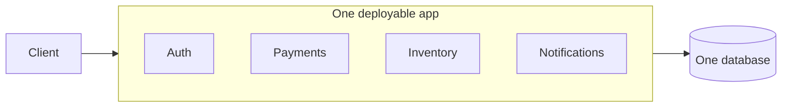

**Monolith** means your entire application—the frontend, backend, database logic, and background jobs—is built, compiled, and deployed as **one single unit**.

```mermaid
flowchart LR
    U["Client"] --> M
    subgraph M["One deployable app"]
        A["Auth"]
        P["Payments"]
        I["Inventory"]
        N["Notifications"]
    end
    M --> DB[("One database")]
```
