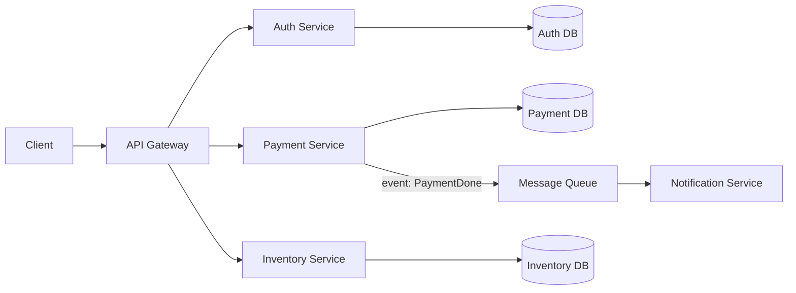

**Microservices** break a monolith down into a collection of **small, independent applications** that communicate with each other over the network using **HTTP, REST, or message queues**.

Each service typically handles a specific business feature, for example:

* **Auth Service**
* **Payment Service**
* **Inventory Service**
* **Notification Service**

Each service is deployed on its own and usually **owns its own database**.

