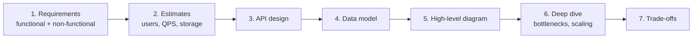

Never jump straight into drawing boxes. Walk the interviewer through a fixed set of steps, out loud.

| Step | What you say |
| ---- | ------------ |
| Requirements | "Should users be able to edit? What scale — 1K or 10M users? Is it read-heavy or write-heavy?" |
| Estimates | 10M users × 10 requests/day ≈ 100M/day ≈ **~1,200 requests/sec** (a day has ~86,400 sec — round it to 100K). |
| API | `POST /urls`, `GET /:code` |
| Data model | Tables / collections and their keys |
| Diagram | Client → LB → API → Cache → DB |
| Deep dive | "What breaks first at 10× traffic?" |

**Tip:** asking clarifying questions is part of the score. Interviewers mark you down for designing the wrong thing confidently.

---
