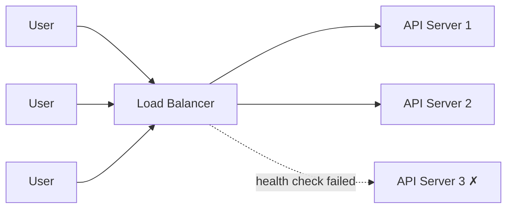

A load balancer sits in front of your servers and spreads incoming requests across them. It also runs **health checks** and stops sending traffic to a dead server.

| Algorithm | How it picks a server |
| --------- | --------------------- |
| Round Robin | 1 → 2 → 3 → 1 → 2 ... |
| Least Connections | The server with the fewest active requests |
| IP Hash | Same client IP always goes to the same server |

Examples: Nginx, AWS ALB, HAProxy.

---
