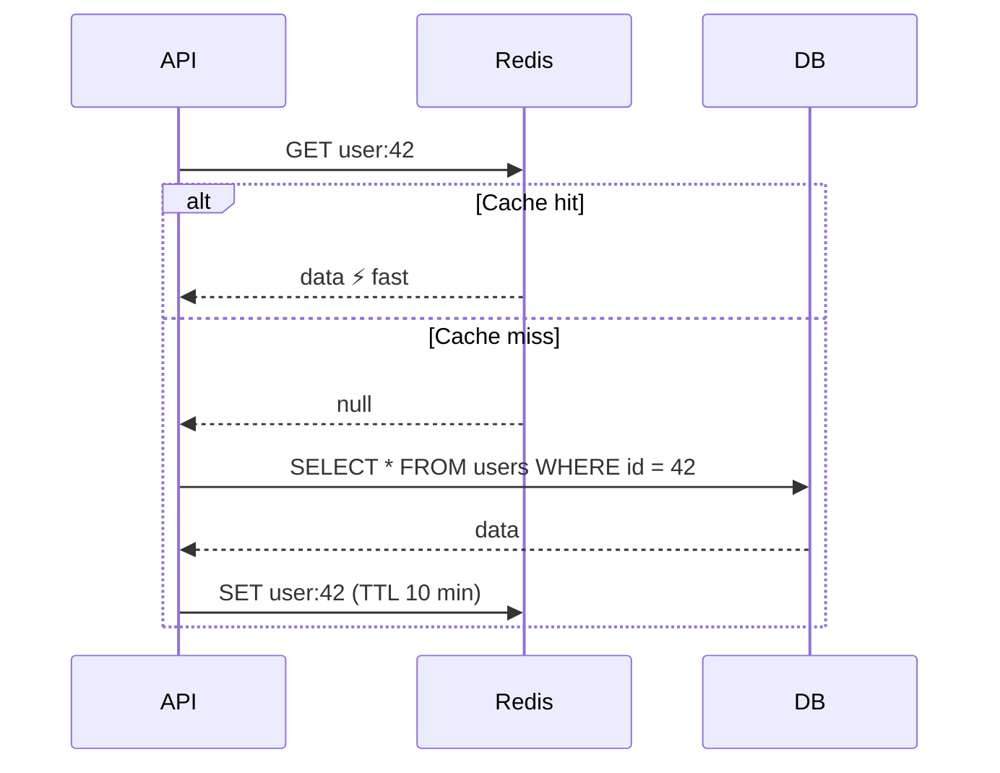

A cache keeps frequently read data in fast memory (Redis) so the database is not hit every time.

**Where caches live:** Browser → CDN → API memory → Redis → DB buffer.

**Invalidation** (the hard part):

- **TTL** — the entry expires after N seconds.
- **Delete on write** — when the user updates, delete `user:42` so the next read refills it.
- **Write-through** — write to cache and DB together.

**Cache stampede:** a hot key expires and 1,000 requests hit the DB at once. Fix it with a lock so only one request refills the cache, or add random jitter to TTLs.

---
