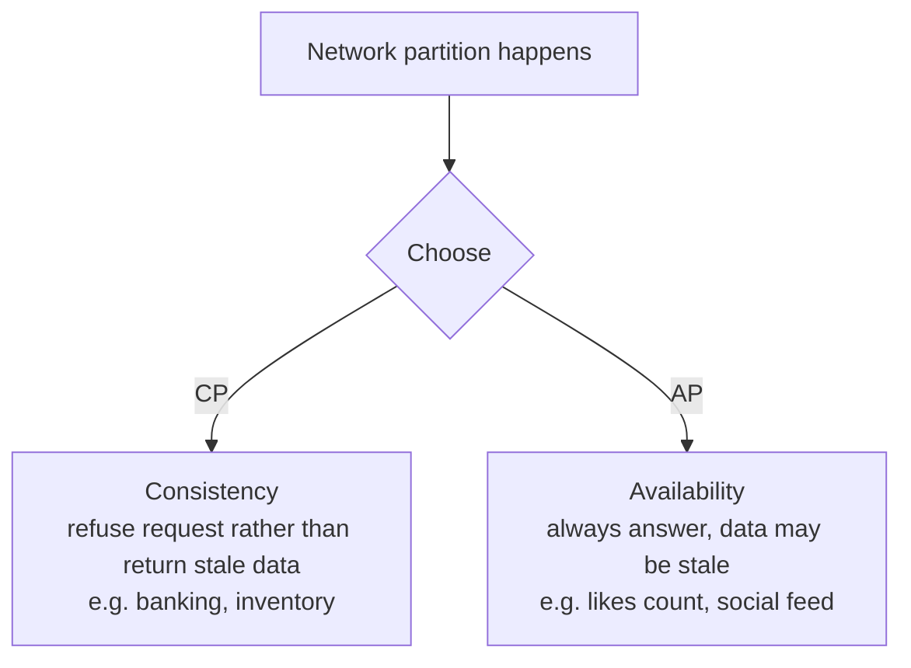

In a distributed system, when the network splits (**P**artition), you must choose between **C**onsistency and **A**vailability.

Partitions will happen, so the real choice is **CP vs AP**, and it can differ per feature in the same app.

---
