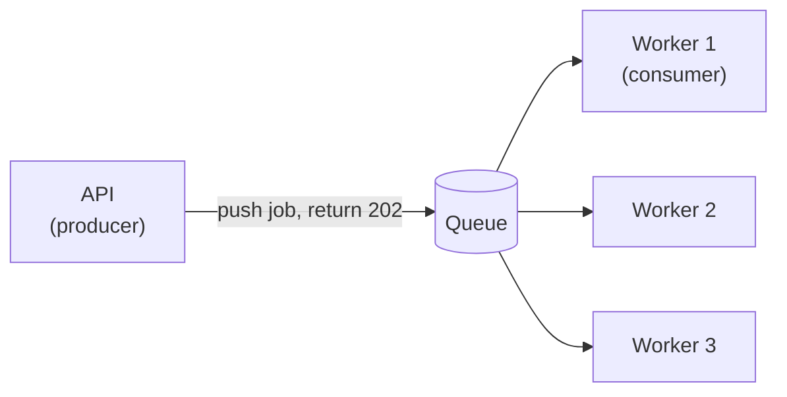

A queue lets one service hand work to another **without waiting** for it to finish.

- **Decoupling** — the API doesn't care how the email gets sent.
- **Buffering** — a spike of 10K jobs waits in the queue instead of crashing workers.
- **Retries** — a failed job goes back to the queue.

| Queue (point-to-point) | Pub/Sub |
| ---------------------- | ------- |
| Each message goes to **one** consumer | Each message goes to **all** subscribers |
| SQS, RabbitMQ, BullMQ | SNS, Kafka topics, Redis Pub/Sub |
| "Send this email" | "Order placed" → email, inventory, analytics all react |

---
