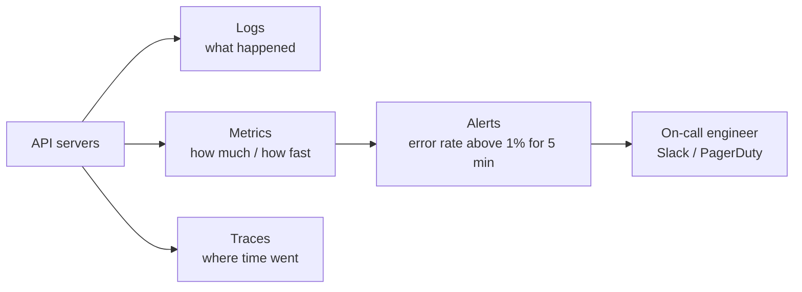

| Signal | Example | Tool examples |
| ------ | ------- | ------------- |
| **Logs** | `ERROR payment failed orderId=91` | CloudWatch Logs, ELK, Loki |
| **Metrics** | requests/sec, p95 latency, error %, CPU | Prometheus + Grafana, Datadog |
| **Traces** | One request: API 20ms → DB 400ms → Stripe 90ms | OpenTelemetry, Jaeger |

**The 4 golden signals** to watch: **latency, traffic, errors, saturation** (how full CPU/memory/connections are).

- Add a **health check** endpoint (`GET /health`) that the load balancer and uptime monitor call.
- Alert on **user-facing symptoms** (error rate, latency), not every CPU spike.
- Put a **request ID** in every log line so you can follow one request across services.

---
