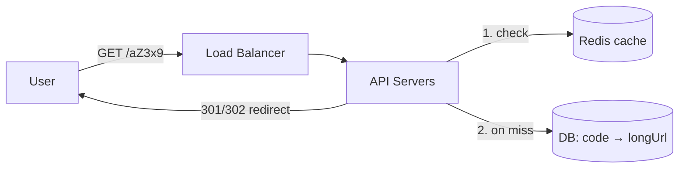

**Requirements:** long URL → short code (`sho.rt/aZ3x9`); redirect fast; read-heavy (~100 reads per write).

**Generating the short code:**

| Approach | How | Trade-off |
| -------- | --- | --------- |
| Base62 of an auto-increment ID | id `125` → `"21"` | Short and unique, but guessable |
| Random 7 chars + uniqueness check | `aZ3x9Qp` | Not guessable, needs a retry on collision |
| Hash (MD5) of URL, take 7 chars | Same URL → same code | Collisions must be handled |

Base62 with 7 characters = 62⁷ ≈ **3.5 trillion** codes.

- **301** (permanent) lets browsers cache the redirect → less load, but you lose click analytics. **302** keeps every click hitting you.
- Cache hot codes in Redis — a few popular links get most of the traffic.

---
