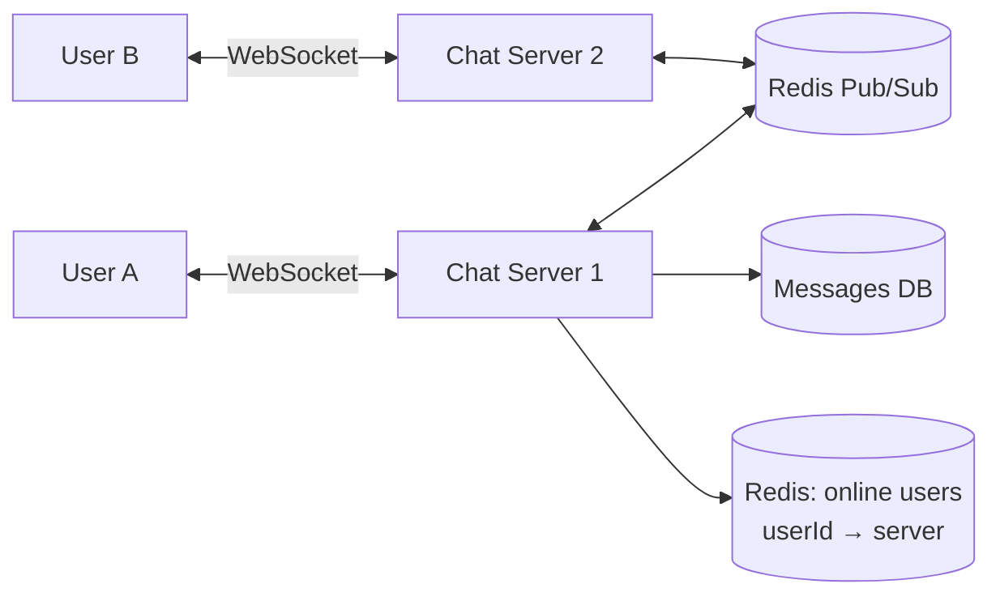

**How a message travels:**

1. A sends a message over its WebSocket to Server 1.
2. Server 1 saves it to the DB (status `SENT`).
3. Server 1 looks up where B is connected → publishes to Server 2 via Pub/Sub.
4. Server 2 pushes it to B → status `DELIVERED`. B opens it → `READ`.
5. If B is **offline**, store it and send a push notification. Deliver it when B reconnects.

- **WebSocket** — a persistent two-way connection (HTTP polling would waste requests).
- **Presence** (online/last seen) — a heartbeat every N seconds, stored in Redis with a TTL.
- Message order — sort by a per-conversation sequence number, not by client clock.

---
