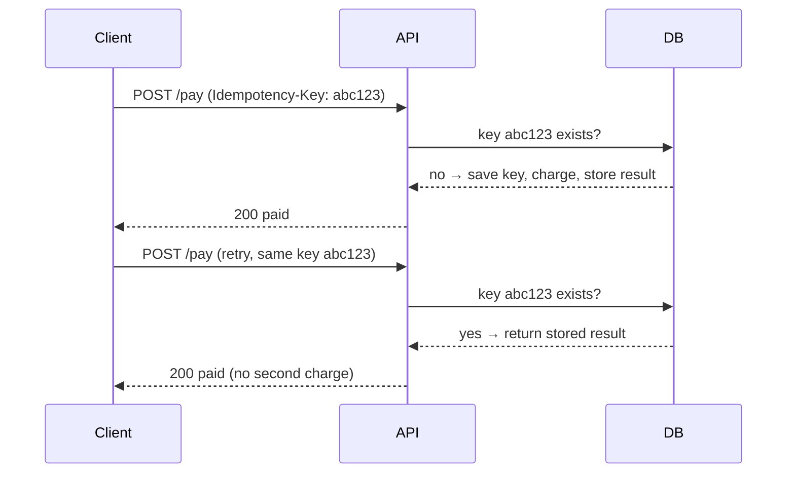

The user double-clicks Pay, or the network times out and the client retries. Use an **idempotency key**.

- The client generates the key once per checkout (UUID).
- Store keys with a **unique constraint**, so even two simultaneous requests can't both insert.
- Also disable the Pay button after the first click — but never rely on the frontend alone.

---
