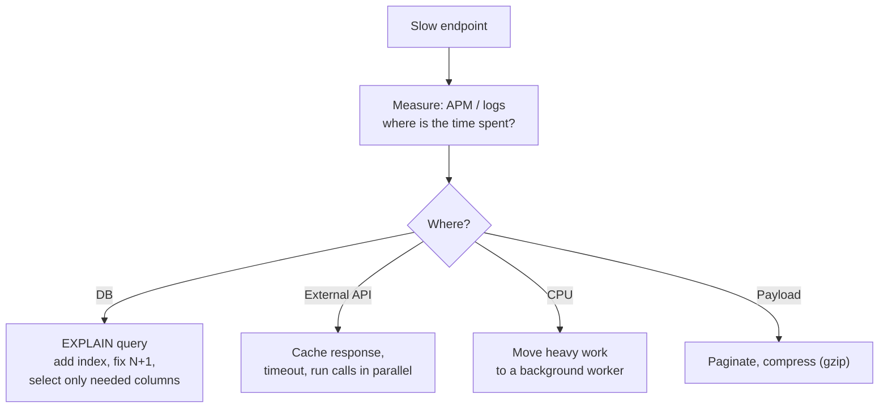

Measure first, then fix the biggest cost.



**N+1 problem** — the most common cause:

```text
✗ 1 query for 100 orders + 100 queries for each order's user = 101 queries
✓ 1 query for orders + 1 query: WHERE user_id IN (...)       =   2 queries
```

Also: `Promise.all` for independent calls, connection pooling, and caching repeated reads.

---
