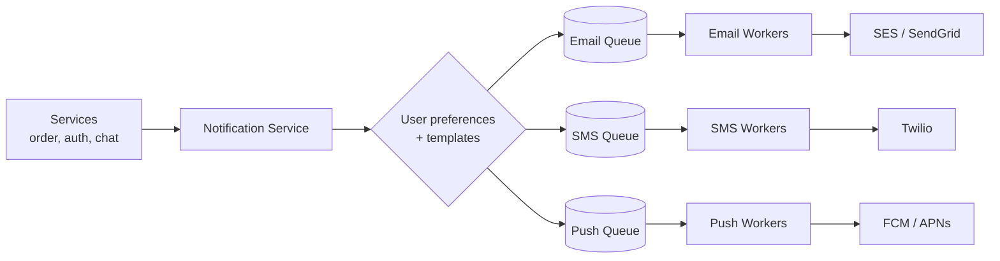

- **One queue per channel** — if SMS is slow, email is not affected.
- Check **user preferences** (opted out of SMS? quiet hours?) before queueing.
- Use **templates** with variables (`Hi {{name}}, your order {{id}} shipped`).
- Priority: OTP/security notifications get their own high-priority queue.
- Same retry, DLQ, and idempotency rules as Q1.

---
