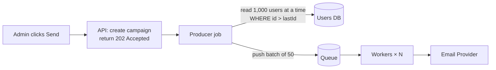

Use an **asynchronous queue-based architecture**: a queue + workers + the provider's batch API + retry/dead-letter handling.

Never send 1M emails inside the API request. The API only accepts the job and returns immediately.

```text
Your API
   │
   ▼
Database: 1M recipients
   │
   ▼
Queue (Redis / SQS / RabbitMQ)
   │
   ▼
Email Workers  (scale horizontally)
   │
   ▼
Email Provider (SES / SendGrid / Mailgun)
   │
   ▼
Provider response
   ├── Success           → mark SENT
   ├── Temporary error   → RETRY
   └── Permanent error   → mark FAILED
                            │
                            ▼
              Dead Letter Queue (DLQ)
                            │
                            ▼
                        Update DB
```

After all retries are exhausted, the message is moved to a **Dead Letter Queue (DLQ)** so it can be inspected or replayed later instead of being lost.

### Scaling to 10 Million — Quick Estimate

```text
10,000,000 emails
Provider limit  ≈ 1,000 emails/sec
Time            ≈ 10,000,000 / 1,000 = 10,000 sec ≈ 2.8 hours
Batch API       = 50 recipients per call → only 200 API calls/sec
```

Don't push 10M messages into the queue from one API request. Use a **fan-out producer** that reads recipients page by page:



- Read recipients with **cursor pagination** (`WHERE id > lastId LIMIT 1000`), not `OFFSET` (see Q12).
- Track progress on the campaign (`sent / failed / total`) so an admin can watch it.
- Send marketing emails at a lower priority than password resets: use **separate queues**.

### Rate Limiting

Every provider has a sending limit (for example SES gives you a per-second quota). Respect it or the provider will throttle or block you.

- Limit how many messages workers pull per second (token bucket in Redis).
- Control concurrency by the number of workers, not by looping faster.
- Use the provider's **batch/bulk API** to send many recipients in one call.

### Retries

- Retry only temporary failures, with **exponential backoff** (1s, 2s, 4s, 8s...).
- Add **jitter** so all workers don't retry at the same moment.
- Cap the attempts (for example 3–5), then move to the DLQ.

### Temporary vs Permanent Errors

| Type          | Examples                                             | Action                     |
| ------------- | ---------------------------------------------------- | -------------------------- |
| Temporary     | Rate limit (429), timeout, provider down (5xx), soft bounce (mailbox full) | Retry with backoff |
| Permanent     | Invalid email, hard bounce, unsubscribed, blocked domain | Mark FAILED, do not retry |

Retrying permanent errors wastes quota and damages your sender reputation.

### Failed Emails

- Store the status per recipient: `PENDING → PROCESSING → SENT / FAILED`.
- Save the provider error code and message for debugging.
- Handle provider **webhooks** (bounce, complaint, delivered) and update the DB.
- Suppress hard-bounced and complained addresses from future campaigns.

### Duplicate Sends

Queues usually guarantee **at-least-once** delivery, so the same message can be delivered twice. Make the worker **idempotent**:

- Give each job a unique **idempotency key** (for example `campaignId + userId`).
- Before sending, check the status — if it is already `SENT`, skip.
- Use a DB unique constraint on `(campaign_id, user_id)` so a duplicate insert fails.
- Pass the idempotency key to the provider if it supports one.

---
