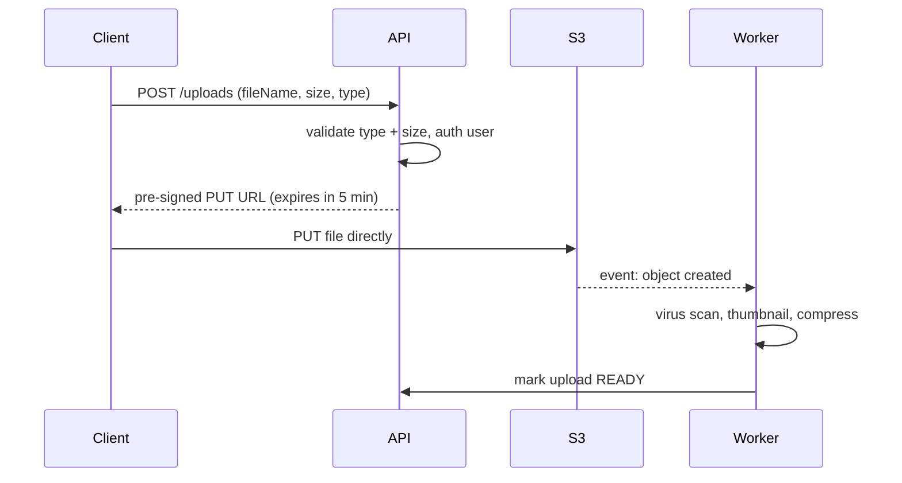

Don't stream big files through your API server. Let the client upload **directly to S3** with a **pre-signed URL**.

- API servers stay free — no 2GB file passing through Node.
- Use **multipart upload** for large files so a failed chunk can be retried.
- Serve files back through a **CDN**.

---
